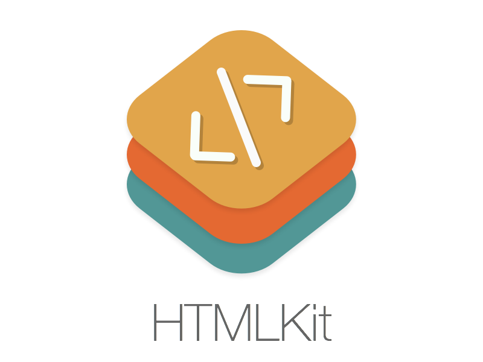

# HTMLKit



An Objective-C framework for your everyday HTML needs.

[](https://travis-ci.org/iabudiab/HTMLKit) [](https://github.com/Carthage/Carthage) [](https://opensource.org/licenses/MIT)

# Quick Overview

HTMLKit is a [WHATWG specification](https://html.spec.whatwg.org/multipage/)-compliant framework for parsing and serializing HTML documents and document fragments for iOS and OSX. HTMLKit parses real-world HTML the same way modern web browsers would.

HTMLKit provides a rich DOM implementation for manipulating and navigating the document tree. It also understands [CSS3 selectors](http://www.w3.org/TR/css3-selectors/) making node-selection and querying the DOM a piece of cake.

## DOM Validation

DOM mutations are validated as described in the [WHATWG DOM Standard](https://dom.spec.whatwg.org). Invalid DOM manipulations throw hierarchy-related exceptions. You can disable these validations, which will also increase the performance by about 20-30%, by defining the `HTMLKIT_NO_DOM_CHECKS` compiler constant.

## Tests

HTMLKit passes all of the [HTML5Lib](https://github.com/html5lib/html5lib-tests) Tokenizer and Tree Construction tests except for the Blink changes introduced on the 16.09.2015. The `html5lib-tests` is configured as a git-submodule. If you plan to run the tests, do not forget to pull it too.

The CSS3 Selector implementation is tested with an adapted version of the [CSS3 Selectors Test Suite](http://www.w3.org/Style/CSS/Test/CSS3/Selectors/current/html/full/flat/index.html), ignoring the tests that require user interaction, session history, and scripting.

## Does it Swift?

Check out the playground!

# Parsing Documents

Given some HTML content, you can parse it either via the `HTMLParser` or instatiate a `HTMLDocument` directly:

```objective-c
NSString *htmlString = @"<div><h1>HTMLKit</h1><p>Hello there!</p></div>";

// Via parser
HTMLParser *parser = [[HTMLParser alloc] initWithString:htmlString];
HTMLDocument *document = [parser parseDocument];

// Via static initializer
HTMLDocument *document = [HTMLDocument documentWithString:htmlString];
```

# Parsing Fragments

You can also prase HTML content as a document fragment with a specified context element:

```objective-c
NSString *htmlString = @"<div><h1>HTMLKit</h1><p>Hello there!</p></div>";

HTMLParser *parser = [[HTMLParser alloc] initWithString: htmlString];

HTMLElement *tableContext = [[HTMLElement alloc] initWithTagName:@"table"];
NSArray *nodes = [parser parseFragmentWithContextElement:tableContext];

for (HTMLNode *node in nodes) {
	NSLog(@"%@", node.outerHTML);
}

// The same parser instance can be reusued:
HTMLElement *bodyContext = [[HTMLElement alloc] initWithTagName:@"body"];
nodes = [parser parseFragmentWithContextElement:bodyContext];
```

# The DOM

Here are some of the things you can do:

* Create new elements and assign attributes

```objective-c
HTMLElement *description = [[HTMLElement alloc] initWithTagName:@"meta"  attributes: @{@"name": @"description"}];
description[@"content"] = @"HTMLKit for iOS & OSX";
```

* Append nodes to the document

```objective-c
HTMLElement *head = document.head;
[head appendNode:description];

HTMLElement *body = document.body;
NSArray *nodes = @[
	[[HTMLElement alloc] initWithTagName:@"div" attributes: @{@"class": @"red"}],
	[[HTMLElement alloc] initWithTagName:@"div" attributes: @{@"class": @"green"}],
	[[HTMLElement alloc] initWithTagName:@"div" attributes: @{@"class": @"blue"}]
];
[body appendNodes:nodes];
```

* Enumerate child elements and perform DOM manipulation

```objective-c
[body enumerateChildElementsUsingBlock:^(HTMLElement *element, NSUInteger idx, BOOL *stop) {
	if ([element.tagName isEqualToString:@"div"]) {
		HTMLElement *lorem = [[HTMLElement alloc] initWithTagName:@"p"];
		lorem.textContent = [NSString stringWithFormat:@"Lorem ipsum: %lu", (unsigned long)idx];
		[element appendNode:lorem];
	}
}];
```

* Remove nodes from the document

```objective-c
[body removeChildNodeAtIndex:1];
[head removeAllChildNodes];
[body.lastChild removeFromParentNode];
```

* Navigate to child and sibling nodes

```objective-c
HTMLNode *firstChild = body.firstChild;
HTMLNode *greenDiv = firstChild.nextSibling;
```

* Manipulate the HTML directly

```objective-c
greenDiv.innerHTML = @"<ul><li>item 1<li>item 2";
```

* Iterate the DOM tree with custom filters

```objective-c
HTMLNodeFilterBlock *filter =[HTMLNodeFilterBlock filterWithBlock:^ HTMLNodeFilterValue (HTMLNode *node) {
	if (node.childNodesCount != 1) {
		return HTMLNodeFilterReject;
	}
	return HTMLNodeFilterAccept;
}];

for (HTMLElement *element in [body nodeIteratorWithShowOptions:HTMLNodeFilterShowElement filter:filter]) {
	NSLog(@"%@", element.outerHTML);
}
```

# CSS3 Selectors

All CSS3 Selectors are supported except for the pseudo-elements (`::first-line`, `::first-letter`, ...etc.). You can use them the way you always have:

```objective-c
// Given the document:
NSString *htmlString = @"<div><h1>HTMLKit</h1><p class='greeting'>Hello there!</p><p class='description'>This is a demo of HTMLKit</p></div>";
HTMLDocument *document = [HTMLDocument documentWithString: htmlString];

// Here are some of the supported selectors
NSArray *paragraphs = [document querySelectorAll:@"p"];
NSArray *paragraphsOrHeaders = [document querySelectorAll:@"p, h1"];
NSArray *hasClassAttribute = [document querySelectorAll:@"[class]"];
NSArray *greetings = [document querySelectorAll:@".greeting"];
NSArray *classNameStartsWith_de = [document querySelectorAll:@"[class^='de']"];

NSArray *hasAdjacentHeader = [document querySelectorAll:@"h1 + *"];
NSArray *hasSiblingHeader = [document querySelectorAll:@"h1 ~ *"];
NSArray *hasSiblingParagraph = [document querySelectorAll:@"p ~ *"];

NSArray *nonParagraphChildOfDiv = [document querySelectorAll:@"div :not(p)"];
```

HTMLKit also provides API to create selector instances in a type-safe manner without the need to parse them first. The previous examples would like this:

```objective-c
NSArray *paragraphs = [document elementsMatchingSelector:typeSelector(@"p")];
NSArray *paragraphsOrHeaders = [document elementsMatchingSelector:
	anyOf(@[
		typeSelector(@"p"), typeSelector(@"h1")
	])
];

NSArray *hasClassAttribute = [document elementsMatchingSelector:hasAttributeSelector(@"class")];
NSArray *greetings = [document elementsMatchingSelector:classSelector(@"greeting")];
NSArray *classNameStartsWith_de = [document elementsMatchingSelector:attributeSelector(CSSAttributeSelectorBegins, @"class", @"de")];

NSArray *hasAdjacentHeader = [document elementsMatchingSelector:adjacentSiblingSelector(typeSelector(@"h1"))];
NSArray *hasSiblingHeader = [document elementsMatchingSelector:generalSiblingSelector(typeSelector(@"h1"))];
NSArray *hasSiblingParagraph = [document elementsMatchingSelector:generalSiblingSelector(typeSelector(@"p"))];

NSArray *nonParagraphChildOfDiv = [document elementsMatchingSelector:
	allOf(@[
		childOfElementSelector(typeSelector(@"div")),
		nay(typeSelector(@"p"))
	])
];
```

Here are more examples:

```objective-c
HTMLNode *firstDivElement = [document firstElementMatchingSelector:typeSelector(@"div")];

var secondChildOfDiv = [firstDivElement querySelectorAll:@":nth-child(2)"];
var secondOfType = [firstDivElement querySelectorAll:@":nth-of-type(2n)"];

secondChildOfDiv = [firstDivElement elementsMatchingSelector:nthChildSelector(CSSNthExpressionMake(0, 2))];
secondOfType = [firstDivElement elementsMatchingSelector:nthOfTypeSelector(CSSNthExpressionMake(2, 0))];

var notParagraphAndNotDiv = [firstDivElement querySelectorAll:@":not(p):not(div)"];
notParagraphAndNotDiv = [firstDivElement elementsMatchingSelector:
	allOf([
		nay(typeSelector(@"p")),
		nay(typeSelector(@"div"))
	])
];
```

One more thing! You can also create your own selectors. You either subclass the CSSSelector or just use the block-based wrapper. For example the previous selector can be implemented like this:

```objective-c
CSSSelector *myAwesomeSelector = namedBlockSelector(@"myAwesomeSelector", ^BOOL (HTMLElement *element) {
	return ![element.tagName isEqualToString:@"p"] && ![element.tagName isEqualToString:@"div"];
});
notParagraphAndNotDiv = [firstDivElement elementsMatchingSelector:myAwesomeSelector];
```

# License

HTMLKit is available under the MIT license. See the LICENSE file for more info.
